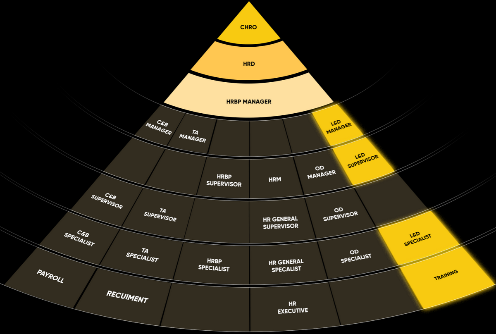

# HR Career Pyramid

A Lit web component that displays an interactive HR career progression pyramid.



## Features

- Pyramid-shaped layout with SVG diagonal angle lines
- 3 shared top tiers: CHRO → HRD → HRBP Manager
- 5 branch rows across 6 career tracks: C&B, TA, HRBP, HR General, OD, L&D
- Click any cell to highlight the entire column
- Fully responsive using CSS container queries

## Development

```bash
bun install
bun dev
```

## Build

```bash
bun run build
```

Outputs `dist/hr-career-pyramid.iife.js` — a single file with Lit bundled in, ready for direct browser use.

## Usage

```html
<hr-career-pyramid></hr-career-pyramid>
<script src="hr-career-pyramid.iife.js"></script>
```
